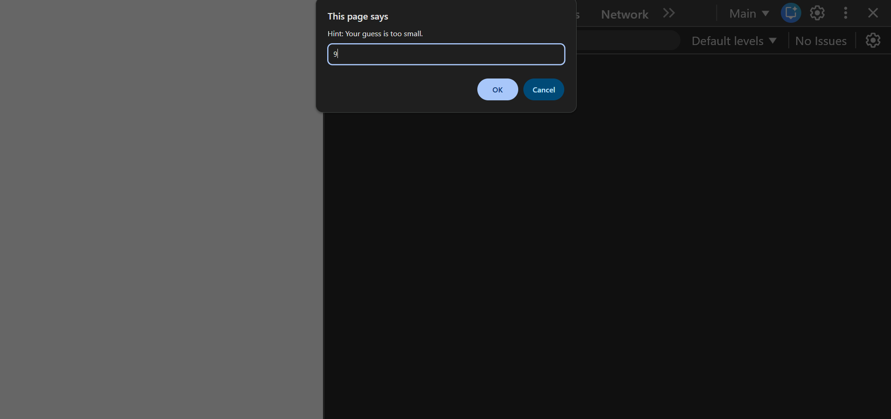
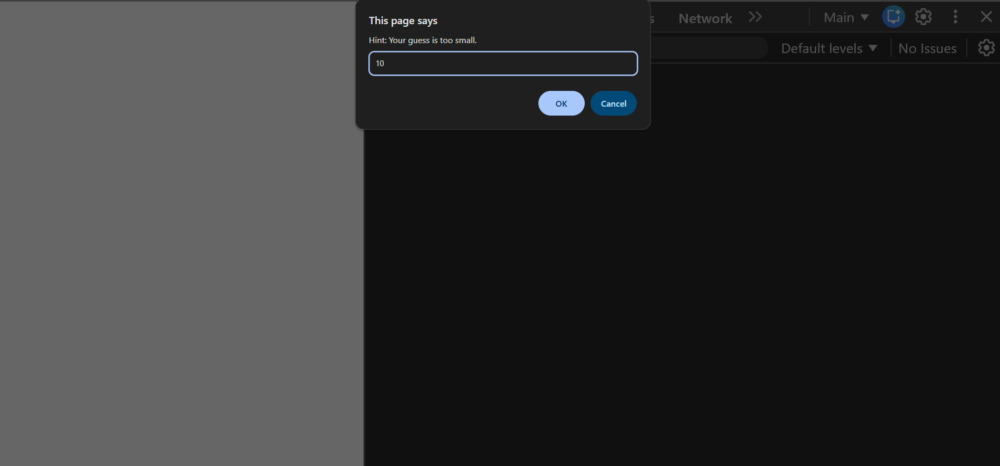
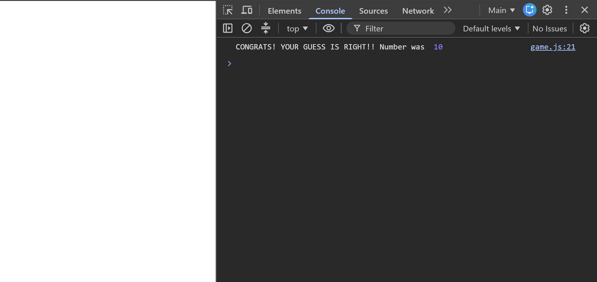

# Number Guessing Game

A simple and beginner-friendly number guessing game made using JavaScript.

In this game, the player first enters a maximum number. The game generates a random number between `0` and the maximum number. The player has to guess the correct number.

The player can type `quit` anytime to exit the game.

## Features

* Enter your own maximum number
* Random number generation using `Math.random()`
* Uses `Math.floor()` to generate a whole random number
* Guess a number between `0` and the maximum number
* Shows a winning message when the guess is correct
* Type `quit` to exit the game
* Beginner-friendly JavaScript project

## How to Play

1. Enter the maximum number.
2. Guess a number between `0` and the maximum number.
3. If your guess is correct, you win the game.
4. If your guess is wrong, try again.
5. Type `quit` anytime to exit the game.

## Technologies Used

* HTML
* JavaScript

## Learning Concepts Used

* Variables
* Data types
* Conditional statements
* Loops
* `Math.random()`
* `Math.floor()`
* User input using `prompt()`

## Folder Structure

```text id="9n2twm"
number-guessing-game/
│
├── index.html
├── app.js
├── README.md
│
└── screenshots/
    ├── screenshot-1.png
    ├── screenshot-2png.png
    ├── screenshot-3.png
    ├── screenshot-4.png
    ├── screenshot-5.png
    ├── screenshot-6.png
    └── screenshot-7.png
```

## Screenshots

### Game Preview 1


### Game Preview 2


### Game Preview 3


### Game Preview 4


### Game Preview 5



### Game Preview 6



### Game Preview 7



## Future Improvements

* Add number of attempts
* Add hints such as “Too high” or “Too low”
* Add a score system
* Add a restart game option
* Improve the design using CSS

## Project Status

Completed basic version. More features will be added after learning more JavaScript.

